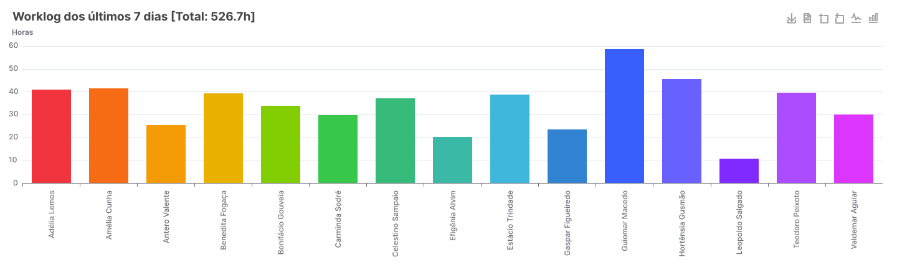
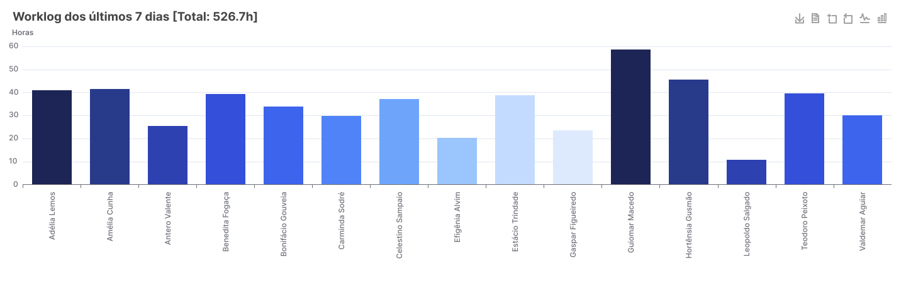
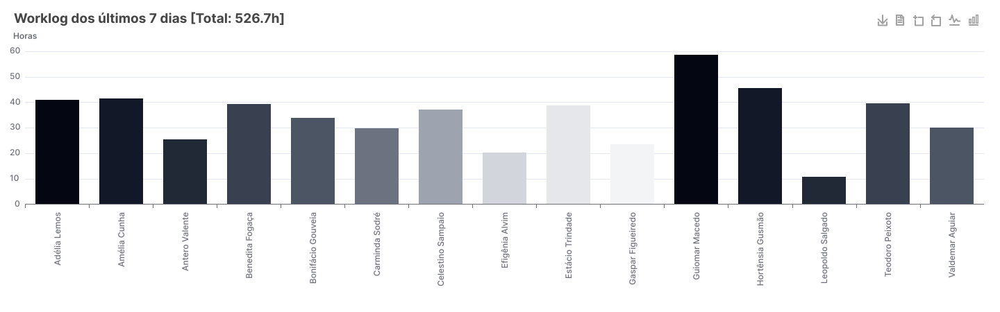
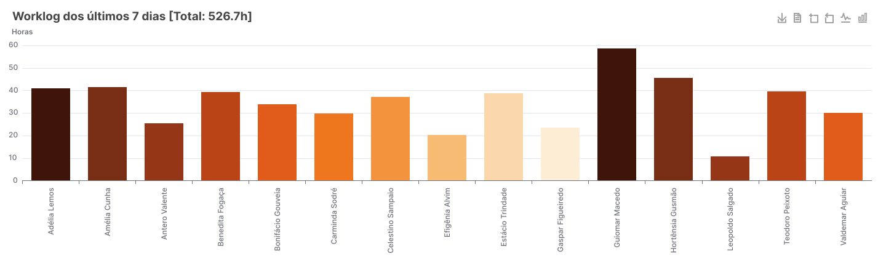
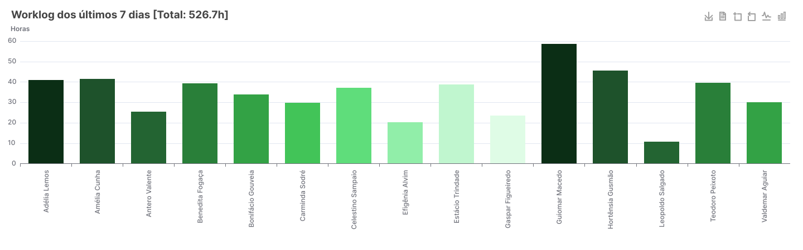
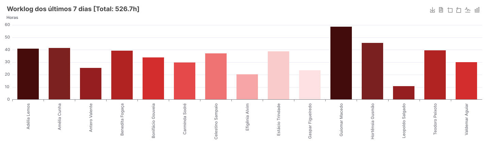
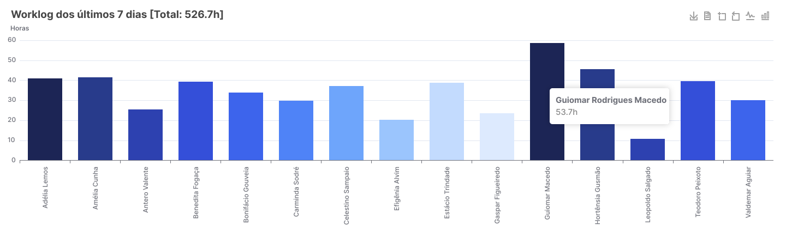
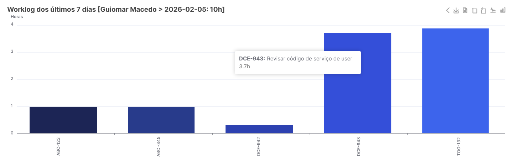
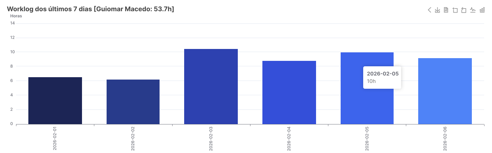

# Jira Worklog Chart Gadget

🌍 **Idiomas:** [ English](https://github.com/Tooark/jira-gadget-worklog/blob/main/README.md) ·  **Português (este arquivo)**

[](https://github.com/sponsors/paulosfjunior)
[](https://ko-fi.com/paulosfjunior)

Gadget Forge para exibir gráficos interativos de worklogs no painel do Jira. O gadget agrega e visualiza tempo de trabalho (worklog) por usuário, permitindo que equipes analisem distribuição de horas, naveguem entre níveis de detalhe (drill-down) e exportem gráficos.

## Principais recursos

- **Filtros dinâmicos:** últimos `n dias`, `usuários`, `jql adicional` configuráveis via `Edit`.
- **Agrupamento:** Gráfico interativo com múltiplos níveis de drilldown/back, exportação e visualização tabular.
- **Navegação interativa:** Por pilha local (drill-down/drill-up) e abertura de issues em nova aba.

**Onde está o código:** veja o diretório [src](src) para frontend/backend.

---

## Pré-requisitos

- **Node.js** — versão LTS 22.x ou 24.x (22 é o mínimo exigido pelas ferramentas de teste)  
  Verifique com `node --version`. Caso precise instalar, use [nvm](https://github.com/nvm-sh/nvm) (macOS/Linux) ou o instalador oficial em [nodejs.org](https://nodejs.org).
- **Forge CLI** — instalado globalmente:

  ```sh
  npm install -g @forge/cli
  forge --version   # confirma a instalação
  ```

- **Conta Atlassian Cloud** com um site de desenvolvimento contendo o Jira.  
  Crie gratuitamente em [go.atlassian.com/cloud-dev](https://go.atlassian.com/cloud-dev) caso ainda não tenha.

---

## Configuração do App Forge

Estas etapas são necessárias apenas na **primeira vez** que você configurar o ambiente, seguindo o [guia oficial de primeiros passos do Forge](https://developer.atlassian.com/platform/forge/getting-started/).

### 1. Gerar um token de API Atlassian

1. Acesse [id.atlassian.com/manage-profile/security/api-tokens](https://id.atlassian.com/manage-profile/security/api-tokens).
2. Clique em **Create API token with scopes**.
3. Dê um nome (ex.: `forge-api-token`), defina a validade e selecione **Forge** como app.
4. Confirme os escopos recomendados e clique em **Create token**.
5. **Copie** o token gerado.

### 2. Autenticar na Forge CLI

```sh
forge login
# informe o e-mail da sua conta Atlassian
# cole o token de API quando solicitado
```

> Em ambientes de CI/CD sem keychain, use variáveis de ambiente:
>
> ```sh
> export FORGE_EMAIL=seu-email@empresa.com
> export FORGE_API_TOKEN=seu-token
> ```

### 3. Registrar o app (somente novos forks/clones)

Se você clonou este repositório e quer registrar um **novo** app no seu ecossistema Atlassian, execute:

```sh
forge register
```

Isso atualizará o `app.id` em [manifest.yml](manifest.yml) com o ID do app criado na sua conta.  
Caso esteja apenas contribuindo para o app existente (`a546d3b1-9757-447c-8403-6513899d61cb`), pule esta etapa.

### 4. Instalar o app no site Jira

Após o primeiro deploy (veja a seção abaixo), instale o app no seu site:

```sh
forge install
# selecione o produto: Jira
# informe a URL do site (ex.: https://meu-site.atlassian.net)
```

---

## Instalação

Clone o repositório e instale as dependências de todos os workspaces:

```sh
git clone https://github.com/Tooark/jira-gadget-worklog.git
cd jira-gadget-worklog
npm install
```

---

## Scripts disponíveis

Execute no diretório raiz do projeto:

| Script                | Descrição                                             |
| --------------------- | ----------------------------------------------------- |
| `npm run build`       | Compila o frontend (Vite) gerando `src/frontend/dist` |
| `npm run clean`       | Remove o diretório `dist` do frontend                 |
| `npm test`            | Executa os testes do frontend com cobertura (modo CI) |
| `npm run lint`        | Lint ESLint + build + lint Forge                      |
| `npm run lint:fix`    | Lint com correção automática                          |
| `npm run lint:tsc`    | Checagem de tipos TypeScript sem emit                 |
| `npm run lint:forge`  | Valida o `manifest.yml` com `forge lint`              |
| `npm run login`       | Autenticação na Forge CLI                             |
| `npm run deploy`      | Build + deploy + upgrade na env padrão (development)  |
| `npm run deploy-hml`  | Build + deploy + upgrade no ambiente **staging**      |
| `npm run deploy-prd`  | Build + deploy + upgrade no ambiente **production**   |
| `npm run deploy-test` | Build + testes + deploy + upgrade (pipeline completo) |

---

## Deploy por ambiente

O projeto mantém três ambientes Forge independentes:

```sh
# desenvolvimento (padrão)
npm run deploy

# homologação
npm run deploy-hml

# produção
npm run deploy-prd

# pipeline completo: build → testes → deploy → upgrade
npm run deploy-test
```

Na primeira instalação em um ambiente novo, use `forge install` (ou `forge install -e staging` / `forge install -e production`) após o deploy para associar o app ao site Jira.

---

## Desenvolvimento local

Para desenvolver com hot-reload usando o túnel Forge:

```sh
# em um terminal — inicia o túnel (conecta a função backend local ao Jira Cloud)
npx forge tunnel

# opcional — em outro terminal, inicia o frontend em modo watch
cd src/frontend
npm start
```

Para rodar apenas os testes do frontend em modo interativo:

```sh
cd src/frontend
npm test        # modo watch
npm run test:ci # CI com cobertura
```

---

## Implementação — componentes principais

- **Edit** ([src/frontend/src/edit/Edit.tsx](src/frontend/src/edit/Edit.tsx)): formulário de configuração do gadget.
  - Campos principais:
    - `days` — número de dias (padrão 7).
    - `color` — paleta/cor do gráfico (ex.: `color`, `blue`, `gray`, ...).
    - `users` — seleção múltipla de usuários (obtida via `getUsers` no backend).
    - `jql` — JQL adicional aplicado antes da agregação.
  - Comportamento: usa `useForgeInvoke('getUsers')` para popular o seletor, mantém `props.formValues` e chama `props.view.submit(...)` para salvar/fechar.

- **View** ([src/frontend/src/view/View.tsx](src/frontend/src/view/View.tsx)): renderiza o gráfico usando `echarts-for-react`.
  - Obtém dados do backend usando `useForgeInvoke('getWorklog', { days, color, query, users })`.
  - Mantém uma pilha `path` para drilldown (root = []).
  - Ao clicar numa barra/segmento:
    - se o nó tem `url`, abre a issue com `router.open(url)`;
    - se o nó tem `children`, adiciona o nó à pilha (`setPath([...])`) para descer.
  - Título dinâmico com total ou contexto do nível atual; tooltips customizados com escape de HTML e formatação `value + 'h'`.
  - Toolbox do chart inclui botão `Voltar`, `Exportar Gráfico`, `Visualizar Dados` (gera tabela HTML), zoom e alternância de tipo (`line`/`bar`).
  - O chart registra handlers `on('click', ...)`/`off('click')` diretamente no objeto retornado por `echarts`.

## Como os dados são formatados

- Cada nó retornado pelo backend é um `TreeNode` com pelo menos: `name`, `value`, `color?`, `summary?`, `url?`, `children?`.
- Os valores são arredondados (uma casa decimal) antes da exibição; cores são aplicadas por `itemStyle.color`.

---

## Exemplos do gadget

### Parâmetro de cor (paleta)

| **Colorido**                                                   | **Azul**                                                  |
| -------------------------------------------------------------- | --------------------------------------------------------- |
|  |  |

| **Cinza**                                                  | **Laranja**                                                     |
| ---------------------------------------------------------- | --------------------------------------------------------------- |
|  |  |

| **Verde**                                                   | **Vermelho**                                                 |
| ----------------------------------------------------------- | ------------------------------------------------------------ |
|  |  |

### Visões de resumo e drilldown





### Variações de cor — opções disponíveis no campo `Cor do Gráfico` em `Edit`

| Valor    | Descrição                |
| -------- | ------------------------ |
| `color`  | Colorido (paleta padrão) |
| `blue`   | Azul                     |
| `gray`   | Cinza                    |
| `orange` | Laranja                  |
| `green`  | Verde                    |
| `red`    | Vermelho                 |

### Drilldown interativo

1. O `View` inicia no nível raiz (agregação por usuário/projeto/período).
2. Clique em uma barra/segmento com `children` → desce um nível (drill-down).
3. Clique em um nó com `url` → abre a issue no Jira via `router.open(url)`.
4. Use o botão **Voltar** na toolbox do gráfico para subir um nível (drill-up).

---

## Contribuição

- Leia o [guia de contribuição](CONTRIBUTING.md) e o [código de conduta](CODE_OF_CONDUCT.md).
- Abra uma issue para sugerir filtros adicionais ou melhorias de UX: [Issues](https://github.com/Tooark/jira-gadget-worklog/issues).
- Pull requests são bem-vindos; mantenha testes e atualize a documentação quando necessário.
- Precisa de ajuda? Veja o [SUPPORT.md](SUPPORT.md).

---

## Apoie o projeto

Se este gadget é útil para você ou sua equipe, considere apoiar o desenvolvimento:

- 💖 **[GitHub Sponsors](https://github.com/sponsors/paulosfjunior)** — patrocínio recorrente ou único pelo GitHub.
- ☕ **[Ko-fi](https://ko-fi.com/paulosfjunior)** — contribuições pontuais ou recorrentes.

Você também pode apoiar gratuitamente deixando uma estrela ⭐ no repositório e divulgando o projeto.

---

## Licenças de terceiros

Este projeto inclui dependências de terceiros redistribuídas no bundle do frontend. Cópias das licenças estão em `LICENSES/`.

- **ECharts** — Apache License 2.0
  - [`LICENSES/echarts-LICENSE.txt`](LICENSES/echarts-LICENSE.txt)
  - [`LICENSES/echarts-NOTICE.txt`](LICENSES/echarts-NOTICE.txt)
  - Fonte oficial: <https://echarts.apache.org/en/js/vendors/echarts/LICENSE>

> Se você gerar um bundle com o código do ECharts, inclua os arquivos acima na distribuição. A inclusão do `NOTICE` pode ser exigida pela seção 4(d) da Apache License 2.0.

## Licença

Apache License 2.0 — consulte o arquivo [LICENSE](LICENSE) para o texto completo.
